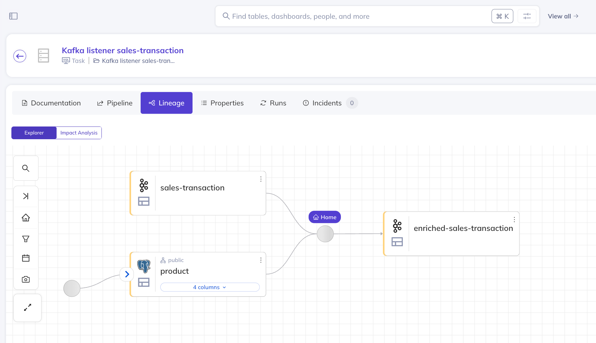

# Java OpenLineage-DataHub integration POC
## What's the purpose of this POC?
This repository is a POC of a java library that plugs into the application and publishes OpenLineage events, that are
used to visualize the Lineage Graph of your application (or multiple applications) in DataHub, or any other Data Catalog
that has proper OpenLineage integration.

There is zero overhead per table / kafka topic. Once it's configured - all nodes and edges of the graph
are collected and published.

Supported technologies
- Postgres (jdbc interceptor)
- Kafka (consumer and producer interceptors)
- Spring Web (not part of the library, library doesn't have Spring)

### How it works:
#### Lineage Graph Nodes
There are two types of Nodes: 
- Kafka Listener
- Http Endpoint (can be extended)

There are interceptors for each (SpringWebLineageInterceptor, KafkaConsumerLineageInterceptor) that put the Lineage Node
name in the MDC context. For Kafka the node name is the topic name, for Spring Web the node name is the controller class
name. This means that all methods on a controller will be aggregated as a single node. GET http requests don't get intercepted, because they don't change state - so don't affect lineage.

Because it's MDC, please keep in mind that if you're spawning new threads you need to pass the context if you want to
preserve lineage information.

#### Lineage Registry

LineageRegistry is a static class that stores a map of all node Lineages registered during application run. Whenever a 
new input or output is registered, a LineageEvent gets emitted.

This is designed for Java applications that are ran in parallel. With multiple instances, after some time each instance 
should have the full lineage. DataHub treats lineage events in a cumulative way (not released yet, check the DataHub 
section at the bottom), but this can differ with other Data Catalogs.

#### Inputs and outputs

Inputs and Outputs of a node are registered using interceptors:
- PostgresJdbcLineageInterceptor 
- KafkaProducerLineageInterceptor
- KafkaConsumerLineageInterceptor

The inputs/outputs are extracted and registered in LineageRegistry. If there are any new outputs/outputs of the node
(node name is retrieved from MDC) - a LineageEvent will be emitted.

#### Performance impact
Extracting the Kafka topic is super straightforward, and for Jdbc openlineage-sql-java library is used that's a java 
wrapper over a Rust parser - so it's pretty efficient, but parsing sql adds a little overhead so for extremely 
latency-sensitive or high volume systems you might want to adapt this setup, for example run in nonprod only, or just turn
it on for a few hours and then disable with some feature toggle. Especially that in this lib only table lineage is present.
OpenLineage has many more features, like data quality, column lineage, column statistics and many others.

## What's in this repository?
### kentra-lineage library
This library has PostgresJdbcLineageInterceptor and two Kafka interceptors. It has minimal dependencies - you can 
use it with any framework you need. 

### java-app 
This is a SpringBootApp working as an example of how to use the library. If you're using a different framework you can
recreate this setup easily, but you might need to create your own interceptor for Http requests - as this POC's logic is
coupled with Spring Web.

### Docker Compose
Docker compose contains DataHub, Kafka and Postgres - all necessary dependencies.

#### DataHub bug
DataHub docker image is locally built from a PR branch containing a bugfix that isn't yet released:

https://github.com/datahub-project/datahub/pull/13347/files

If you want to run this POC with DataHub, you'll need to build all DataHub docker containers locally and tag them `debug`.

## How to run it?
### Prerequisites
   - Docker
   - Java 21
### Step by step guide to see the lineage graph in DataHub
1. Build the java app:

run the build script from the project root:
```bash
  ./gradlew clean build
```
It builds the app.jar that's used in the docker compose

2. Run docker-compose
```bash
  docker compose up -d
```
It will take time for the first time as you need to pull docker images. If anything goes wrond, recreate the 
failing containers.

3. Run the scripts that will create a product in the db and publish a message to the kafka topic (via kafka-rest-proxy)
```bash
  ./scripts/create-product.sh
  ./scripts/publish-sales-transaction.sh 
```
4. Validate in Kafka UI (`localhost:8090`) that the following topics were created:
- sales-transaction
- enriched-sales-transaction

At this stage you should have all topics created and schemas registered. Now you can ingest Postgres and Kafka metadata into DataHub.

5. Open DataHub and ingest metadata from Postgres and Kafka.
    - Open DataHub UI at http://localhost:9002. Credentials are `datahub/datahub`.
    - Click the Data Sources button on the left. If it's not there (happened a few times to me), cleaning browser cache
      or recreating the datahub-frontend-gms helps
    - You'll be creating thew new data sources:
        - Postgres:
            - Host and Port: `postgres:5432`
            - Username: `postgres`
            - Password: `postgres`
            - Database: `java_openlineage_poc_db`
            - Name: `Postgres or whatever you want`
        - Kafka:
            - Bootstrap Servers: `kafka:9094`
            - Schema Registry URL: `http://schema-registry:8081`
            - Name: `Kafka or whatever you want`

This should trigger two ingestion jobs. After they finish you should see 10 kafka topics and 3 postgres objects ingested
after clicking the "View all" button right to the Search Bar you can see on top of the page.

6. Run your java-app with OpenLineage integration enabled.
- stop and delete your java-app docker container
```bash
  docker compose down java-app --volumes
```
- Change the openlineage.yml configuration that's in ./openlineage/openlineage.yml
Comment the `type: console` line, uncomment `type: http` and `url: ...` lines.
- Run the service again. With the changed configuration mounted, the application will start emitting lineage events.
```bash
  docker compose up java-app -d
```

7. Run the scripts producing data again:
```bash
  ./scripts/create-product.sh
  ./scripts/publish-sales-transaction.sh
```
This time the whole setup is ready, and the application will publish the OpenLineage events to the http endpoint.

8. Validate in DataHub UI (`localhost:9002`) that the lineage data is ingested:
- click the search box on the top
- open "Kafka listener sales-transaction" task (not Pipeline)
- click the "Lineage" tab
- unwrap the nodes (left of both output topics) to see the full lineage graph.

Expected result:


